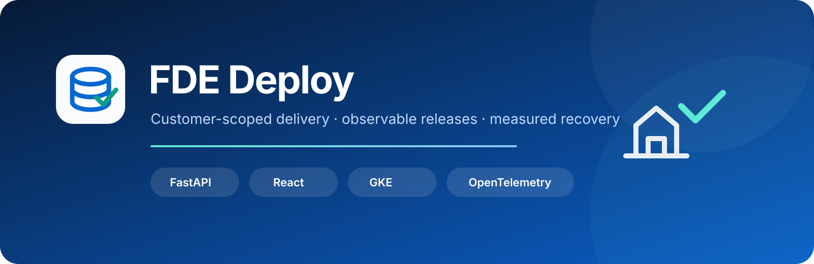

# FDE Deploy

[](https://github.com/Abdul-RehmanCU/FDE_Deploy_Template/actions/workflows/ci.yml)
[](LICENSE)
[](.python-version)
[](PLAN.md)

FDE Deploy is a reusable field deployment template for taking a customer data application from source to a customer-scoped environment. It demonstrates the work around the application as carefully as the application itself: validation, identity, immutable releases, telemetry, failure recovery, bounded cost, evidence collection, and teardown.

The product is a guided contact onboarding workflow. Administrators and operators upload a CSV, map its columns, review row-level validation outcomes, explicitly confirm valid records, and search the resulting directory. Viewers have read-only access. PostgreSQL is the durable authority for users, imports, jobs, contacts, the transactional outbox, and audit activity.

> [!IMPORTANT]
> The application and inexpensive CI paths are implemented and exercised. The managed GCP profile is implemented and statically validated but has not been deployed. A paid GKE rehearsal remains gated by the cost, expiry, CI, kind, and review evidence defined in [PLAN.md](PLAN.md).

## Contents

- [What is implemented](#what-is-implemented)
- [Architecture](#architecture)
- [Proven evidence](#proven-evidence)
- [Working application gallery](#working-application-gallery)
- [Repository map](#repository-map)
- [Cloud-first quickstart](#cloud-first-quickstart)
- [Optional local setup](#optional-local-setup)
- [Release and recovery](#release-and-recovery)
- [Cost and teardown](#cost-and-teardown)
- [Security model](#security-model)
- [Current limitations](#current-limitations)
- [Provenance](#provenance)

## What is implemented

| Capability | Behavior | Evidence state |
| --- | --- | --- |
| Managed identity | Administrator, operator, and viewer roles; no public signup; one-time temporary passwords; token invalidation after account changes | Real PostgreSQL/Redis CI |
| CSV onboarding | UTF-8/BOM-aware upload, 10 MiB and 10,000-row bounds, source preview, explicit mapping, validation before mutation | Unit, contract, real-service, and browser CI |
| Data safety | Normalized email matching, within-file and directory deduplication, formula-safe report exports, transactional confirmation | Real PostgreSQL CI |
| Durable jobs | PostgreSQL outbox, Celery transport, bounded retries, cancellation, replay safety, stalled-job reconciliation | Real PostgreSQL/Redis CI |
| Customer UI | Responsive overview, imports, mapping, validation review, jobs, directory, user administration, audit activity, loading/error/empty states | Desktop/mobile browser CI |
| Delivery controls | Immutable customer configuration, cost and evidence gates, explicit plan/deploy/verify/rollback/evidence/destroy commands | CLI tests |
| GCP demo profile | Configured zonal GKE, fixed node, Artifact Registry, regional storage, Workload Identity, exact-resource expiry cleanup | Terraform validation; live proof pending |
| Managed profile | Private regional GKE, HA Cloud SQL, HA Redis, regional storage, Secret Manager, deletion protection | Implemented, not live-tested |
| Observability | OpenTelemetry, Prometheus, Loki, Tempo, Grafana, internal services, five alert classes | Correlated kind runtime and screenshot evidence; GKE repetition pending |

## Architecture

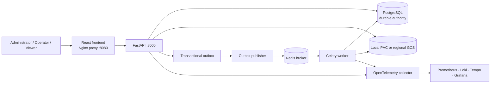

Each customer installation has explicit customer, environment, project, namespace, image, region, sizing, and secret references. Staging and production-demo use separate namespaces, credentials, databases, and Redis instances on the short-lived demo cluster. The managed profile uses separate durable regional services and remains opt-in.

The detailed contracts live in [application workflow](docs/application.md), [data contract](docs/data-contract.md), [API guide](docs/api.md), and [security model](docs/security-model.md).

## Proven evidence

The [implementation ledger](docs/implementation-ledger.md) separates real execution from static checks and pending work. It records tested SHAs, workflow URLs, commit accounting, external changes, and every acceptance criterion.

The latest fully green acceptance run is [CI run 35718898057](https://github.com/Abdul-RehmanCU/FDE_Deploy_Template/actions/runs/35718898057) at `e71419e`. It passed Python 3.14 lint/types, 50 PostgreSQL/Redis tests, migration-aware readiness, disposable backup/restore, generated-client drift, browser journeys, CLI tests, Terraform validation and mocked managed plans, Helm/Alloy/kubeconform checks, the full application kind rehearsal, and the isolated telemetry rehearsal. [Security run 35718898011](https://github.com/Abdul-RehmanCU/FDE_Deploy_Template/actions/runs/35718898011) passed dependency, secret, backend/frontend image, and Terraform policy scans at the same revision.

## Working application gallery

These screenshots were captured by the real-stack Playwright job in [run 35706376224](https://github.com/Abdul-RehmanCU/FDE_Deploy_Template/actions/runs/35706376224) at `93d7c85`, using PostgreSQL, Redis, the API, publisher, worker, and deterministic synthetic records on a GitHub-hosted runner. They are CI application evidence, not GKE or production evidence.

| Overview | Column mapping and source preview |
| --- | --- |
| 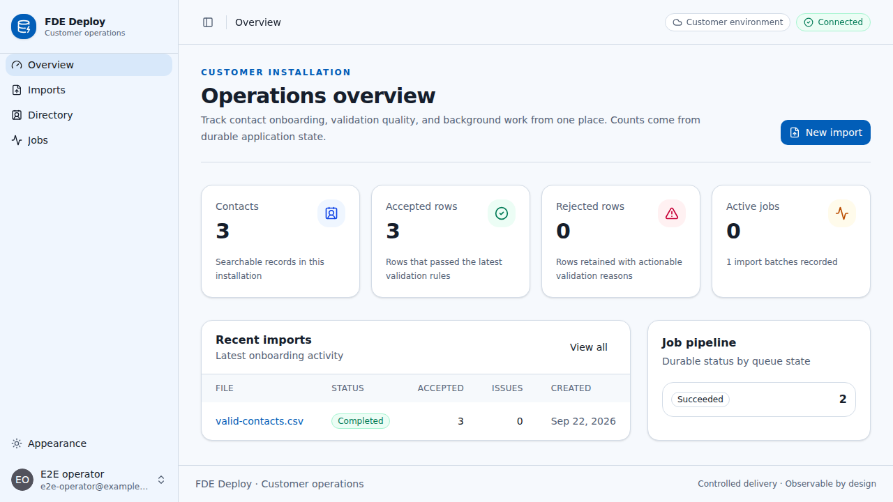 | 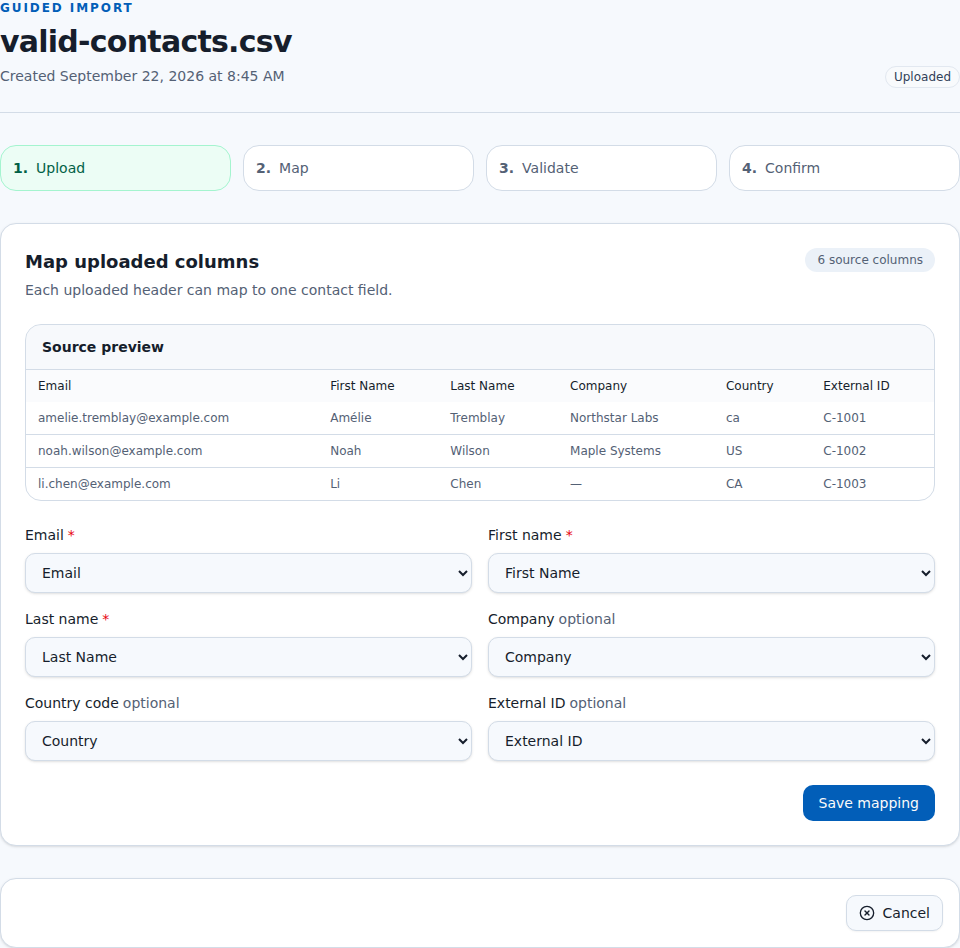 |

| Validation review | Completed import |
| --- | --- |
| 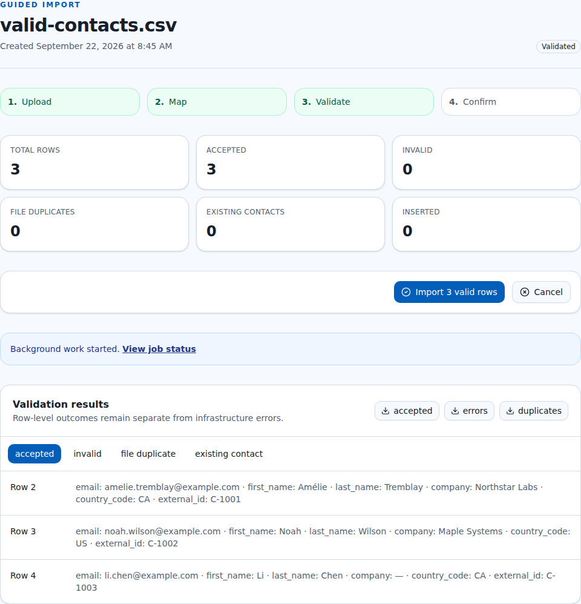 | 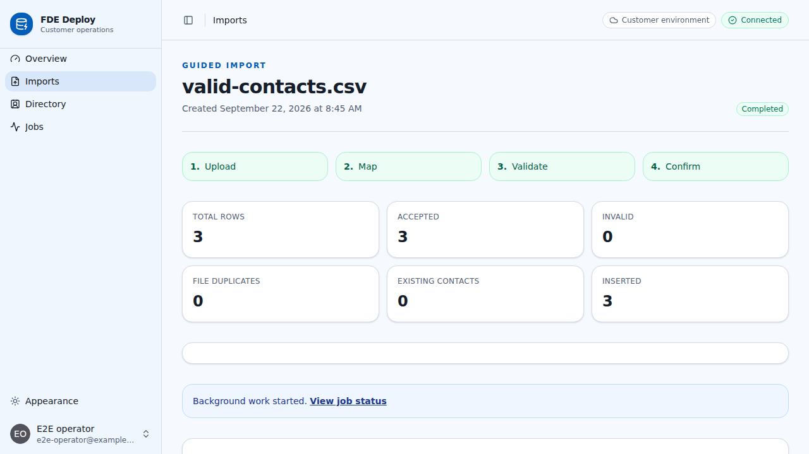 |

| Searchable directory | User administration |
| --- | --- |
| 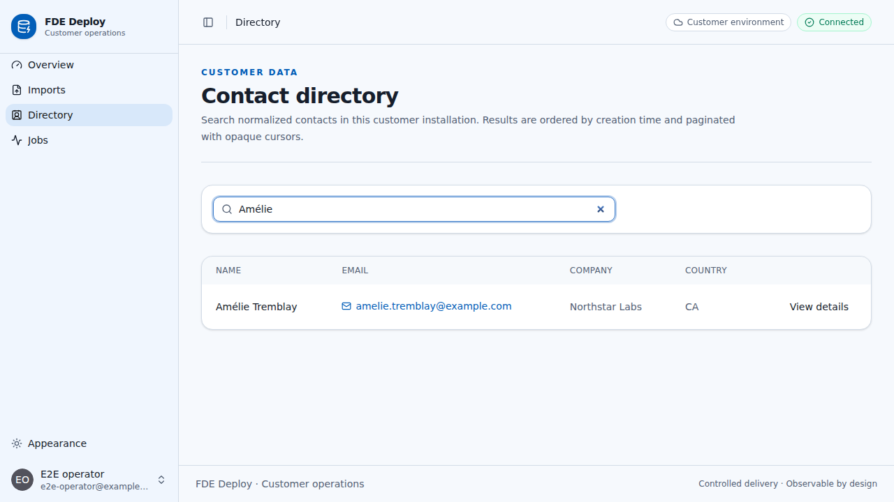 | 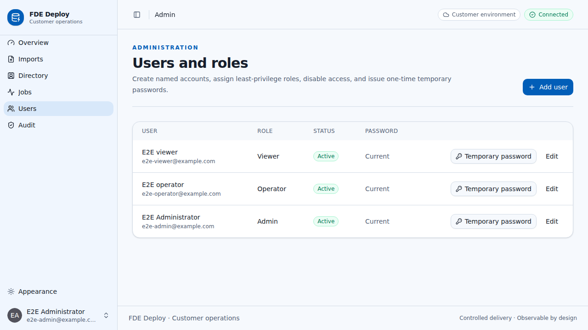 |

| Mobile mapping | Mobile validation |
| --- | --- |
| 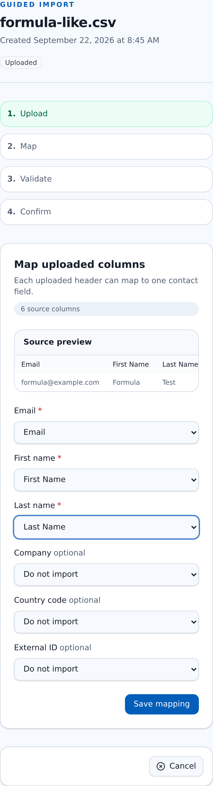 | 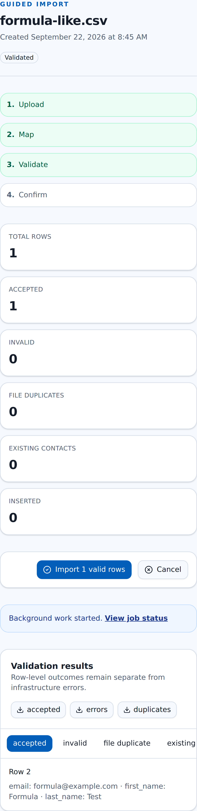 |

[Watch the synthetic desktop import walkthrough](docs/media/browser-walkthrough.webm).

## Kind observability gallery

These screenshots were captured from the real observability stack in the isolated kind job of [run 35718898057](https://github.com/Abdul-RehmanCU/FDE_Deploy_Template/actions/runs/35718898057) at `e71419e` (artifact `10691161653`). The synthetic validation job produced one correlated trace across `fde-api`, `fde-outbox-publisher`, and `fde-worker`; Loki returned API/publisher/worker log counts `1/1/3`; the alert fired for `fde-staging` and then resolved. This is GitHub-hosted kind evidence, not GKE or production evidence.

| Populated Grafana dashboard | Correlated Tempo trace |
| --- | --- |
| 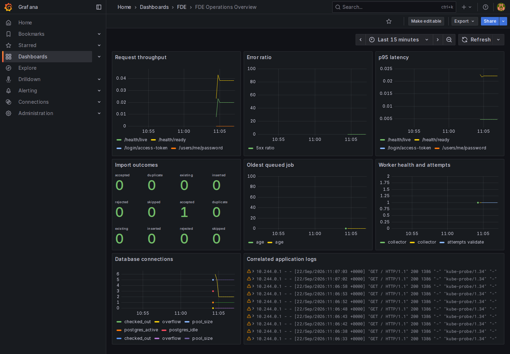 | 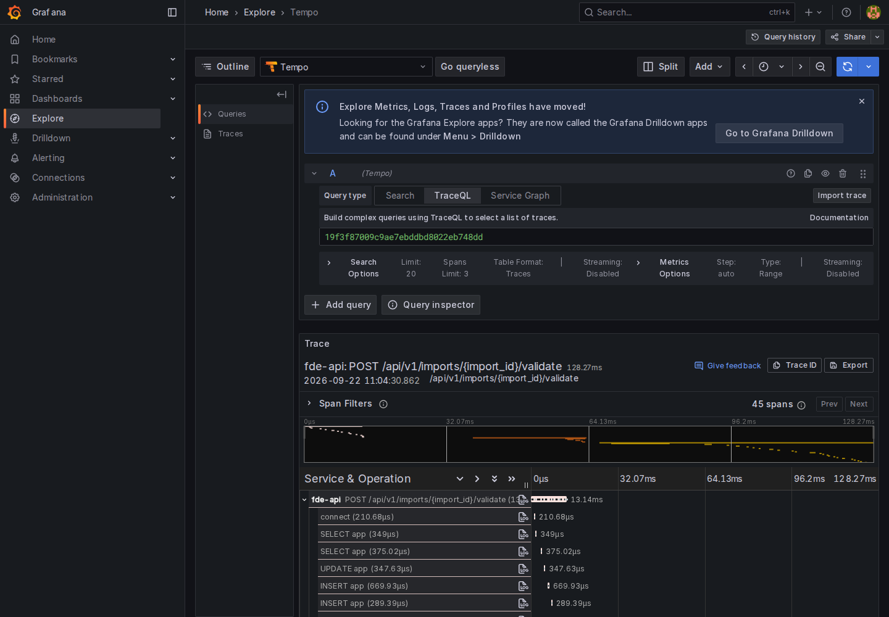 |

| Exact-trace Loki logs | Alert firing and resolved |
| --- | --- |
| 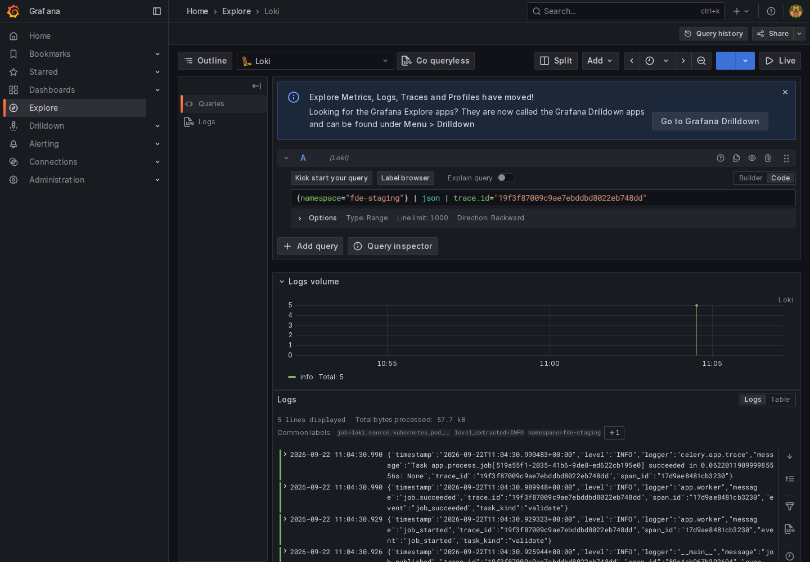 | 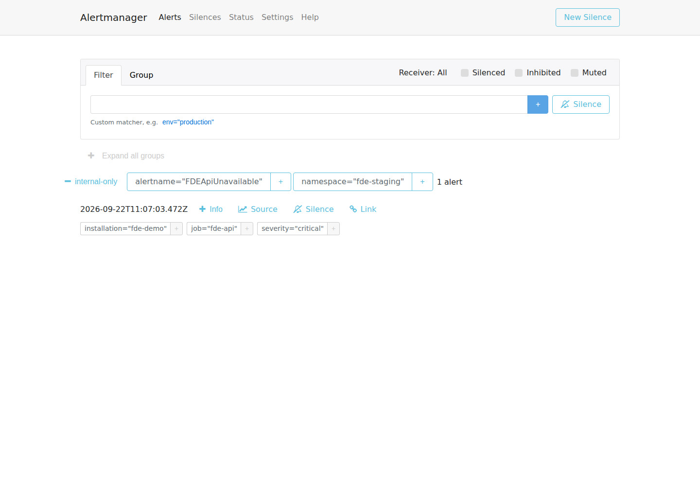 |

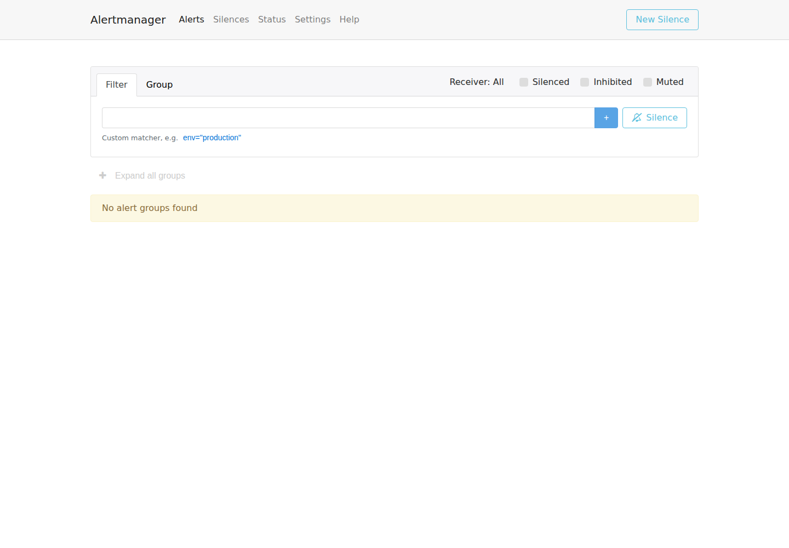

GKE rollout, live-cloud telemetry, cleanup, and teardown media remain separate acceptance evidence.

## Repository map

```text
backend/                 FastAPI, SQLModel, Alembic, workers, tests
frontend/                React, TypeScript, generated API client, Playwright
fixtures/customer-data/  Deterministic CSV acceptance fixtures
infra/helm/fde/          Application and demo dependency chart
infra/terraform/         Bootstrap, demo, expiry, and managed profiles
observability/helm/      Compact metrics, logs, traces, dashboards, alerts
tooling/fde/             Guardrailed cross-platform deployment CLI
docs/                    Contracts, operations, evidence, handover
```

## Cloud-first quickstart

Prerequisites are GitHub, a dedicated GCP project, `gcloud`, Terraform 1.15.8, Helm, `kubectl`, and Python 3.14/uv. GCP authentication uses Workload Identity Federation; do not create or download service-account keys.

1. Copy [the demo customer example](infra/config/customers/demo.example.yaml) and replace every placeholder with the dedicated project, customer, immutable image digests, and secret references.
2. Validate configuration and local prerequisites:

   ```bash
   uv run --project tooling/fde fde validate-config path/to/customer.yaml
   uv run --project tooling/fde fde doctor path/to/customer.yaml
   ```

3. Confirm the [cost estimate](infra/cost/demo-estimate.yaml) and [cost ledger](infra/cost/ledger.demo.json). The paid gate requires an estimate at or below USD 10, current CI/kind evidence, an independently reviewed exact resource manifest, and expiry no later than four hours from the first paid action.
4. Apply the expiry state and prove its sentinel before the demo state. The separate roots are under `infra/terraform/environments/expiry` and `infra/terraform/environments/demo`.
5. Use a reviewed saved plan and the guarded CLI:

   ```bash
   uv run --project tooling/fde fde plan path/to/customer.yaml
   uv run --project tooling/fde fde deploy path/to/customer.yaml
   uv run --project tooling/fde fde verify path/to/customer.yaml
   uv run --project tooling/fde fde evidence path/to/customer.yaml
   uv run --project tooling/fde fde destroy path/to/customer.yaml
   ```

The repository does not authorize a paid run by itself. Follow the exact sequence and evidence gates in [PLAN.md](PLAN.md).

## Optional local setup

Local execution is for development convenience. GitHub-hosted CI is the canonical inexpensive integration path.

```bash
cp .env.example .env
uv sync --locked --all-groups
bun install --frozen-lockfile
docker compose up -d db redis
cd backend && uv run alembic upgrade head
uv run fastapi run app/main.py --port 8000
```

In separate terminals, start the publisher, worker, and frontend:

```bash
cd backend && uv run python -m app.outbox_publisher
cd backend && uv run celery -A app.worker.celery_app worker
bun run --filter frontend dev
```

Create the first administrator with `cd backend && uv run python -m app.bootstrap_admin admin@example.com`. The command prints a one-time password that must be changed after sign-in. Never commit it.

## Release and recovery

The intended release flow builds once, identifies immutable image digests, migrates before rollout, verifies readiness and a business-flow smoke test, and promotes the same digests. A failed application rollout returns to the previous Helm release; database migrations are not automatically reversed.

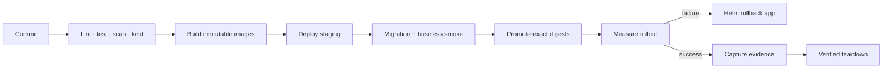

See [database recovery](docs/database-recovery.md) for backup/restore boundaries and [backend testing](docs/backend-testing.md) for reproducible checks.

## Cost and teardown

- Total authorized GCP spend is USD 25, with at most USD 10 estimated for the single demo and USD 15 reserved for delayed charges and cleanup.
- The planned demo estimate is USD 4.96619304; billing was CA$0 at the captured baseline, with an explicit reporting-delay caveat. Paid provisioning still requires a separate private baseline observed within 30 minutes.
- Primary expiry is planned at two hours. Three exact-minute scheduler attempts must begin within the four-hour maximum.
- Cleanup targets an allowlisted resource manifest and never deletes the project.
- A successful destroy command is insufficient: evidence must include the remaining cluster, VM, disk, IP, registry, bucket, workflow, scheduler, Helm, and Kubernetes inventory.

## Security model

Secrets are environment variables only for local/CI use. GKE workloads read mounted Secret Manager values through Workload Identity. Logs, metrics, traces, and evidence must exclude tokens, passwords, CSV contents, contact PII, raw Terraform state, and kubeconfigs. Browser evidence publishing is restricted to synthetic screenshots and WebM recordings; authentication storage and traces are excluded.

Report downloads always pass API authorization, and viewer accounts cannot mutate imports or download reports. Prometheus endpoints and operational dashboards remain internal. See [security model](docs/security-model.md) for the full role and trust-boundary description.

## Current limitations

- The short-lived demo uses a shared zonal cluster with in-cluster PostgreSQL and Redis. Namespace separation demonstrates release isolation, not independent production failure domains.
- The managed profile is implemented and statically validated but not live-tested.
- GKE release, rollback, alert, trace, backup/restore, and final teardown evidence must come from the bounded live rehearsal.
- No public load balancer, paid domain, SMTP provider, CRM, or public signup is included.
- The repository makes no compliance certification or guaranteed zero-downtime claim.

## Provenance

The source baseline is FastAPI's Full Stack FastAPI Template pinned to `cb740b656d7a0a6c5e12c7bf8e50343ec94ee9c7`. Its MIT notice is retained. [Upstream provenance](docs/upstream-provenance.md) lists imported and excluded material. Upstream history is not present and is not counted toward this repository's substantive-commit requirement.

Licensed under the [MIT License](LICENSE).
