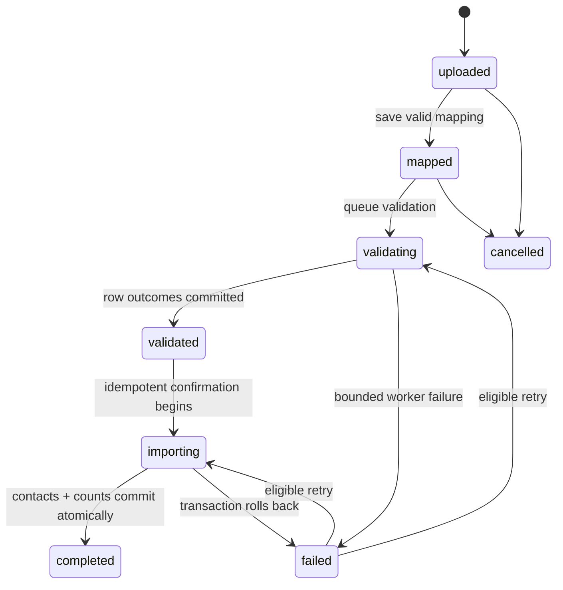
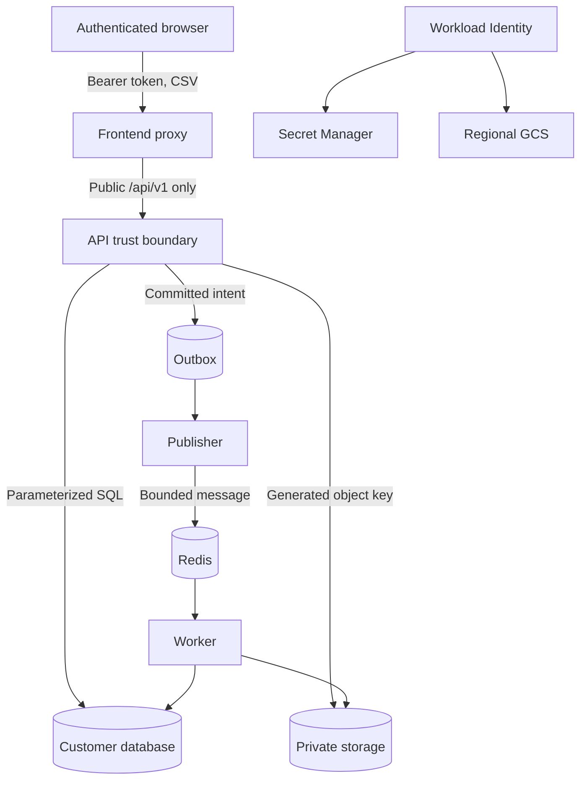

# Architecture

FDE Deploy separates customer configuration, application state, asynchronous execution, cloud lifecycle, and evidence so each consequential transition has a deterministic gate.

## Runtime components

| Component | Responsibility | Durable state |
| --- | --- | --- |
| Frontend proxy | Serves the React application and proxies public `/api/` traffic | None |
| FastAPI | Authentication, authorization, uploads, mapping, confirmation, directory, audit, health/version | PostgreSQL and storage adapter |
| Outbox publisher | Claims committed outbox rows and publishes bounded Celery messages | PostgreSQL outbox |
| Worker | Validates rows, produces reports, atomically confirms contacts, reconciles retries/cancellation | PostgreSQL and storage adapter |
| PostgreSQL | Authority for users, roles, imports, outcomes, contacts, jobs, attempts, outbox, audit | Persistent volume or Cloud SQL |
| Redis | Transport only; losing broker state must not lose durable job intent | Ephemeral transport |
| Storage adapter | Private uploads and generated reports | Shared PVC in kind/demo or regional GCS |
| Telemetry stack | Internal metrics, logs, traces, dashboards, alerts | Bounded observability PVCs |

## Import state flow

Validation never mutates the directory. Confirmation locks the import, rechecks state, inserts normalized-email contacts with conflict protection, records actual inserted/skipped counts, and commits job/import/audit state together.

## Job delivery

The API writes `job` and `job_outbox` in the same database transaction as the state transition. The publisher claims rows with PostgreSQL locking, attempts Redis publication with bounded network timeouts, and records publication. The worker locks each job before an attempt. Concurrent or repeated delivery observes `running`, `succeeded`, or `cancelled` and does not repeat side effects.

Periodic reconciliation returns stale running jobs to the queue and republishes queued work only when the prior outbox publication is itself stale. Heartbeats bound false recovery during long validation.

## Trust boundaries

The browser never reaches internal metrics, PostgreSQL, Redis, object storage, Grafana, or cloud control planes. Upload filenames are metadata only and never become filesystem/object paths. All downloads return through an authorized API route.

## Deployment profiles

The demo profile uses one fixed zonal GKE node and in-cluster PostgreSQL/Redis to keep the rehearsal bounded. Staging and production-demo use separate namespaces/secrets/data services on that shared cluster.

The managed profile uses private regional GKE, HA Cloud SQL/Redis, regional GCS, Secret Manager, and deletion protection. It has its own composition root and remains implemented-not-live-tested.

## Delivery state

Build produces separate backend and frontend images. The same immutable digests move from staging to production-demo. A migration Job precedes rollout. Helm tracks application revisions; rollback restores the previous application configuration and images but never reverses the database migration.

Expiry infrastructure is a separate Terraform state installed before demo GKE. Three exact-minute Scheduler attempts invoke a dedicated Workflow against an immutable ownership manifest. Resource names, labels, project number, manifest hash, and creation timestamps prevent cleanup from targeting unrelated or future same-named resources.

## Evidence boundary

The implementation ledger ties each claim to a commit and workflow. Local/unit, service-container, browser, kind, GKE, and managed-service evidence remain distinct. Only sanitized screenshots, videos, summaries, hashes, and aggregate measurements enter the public repository.
